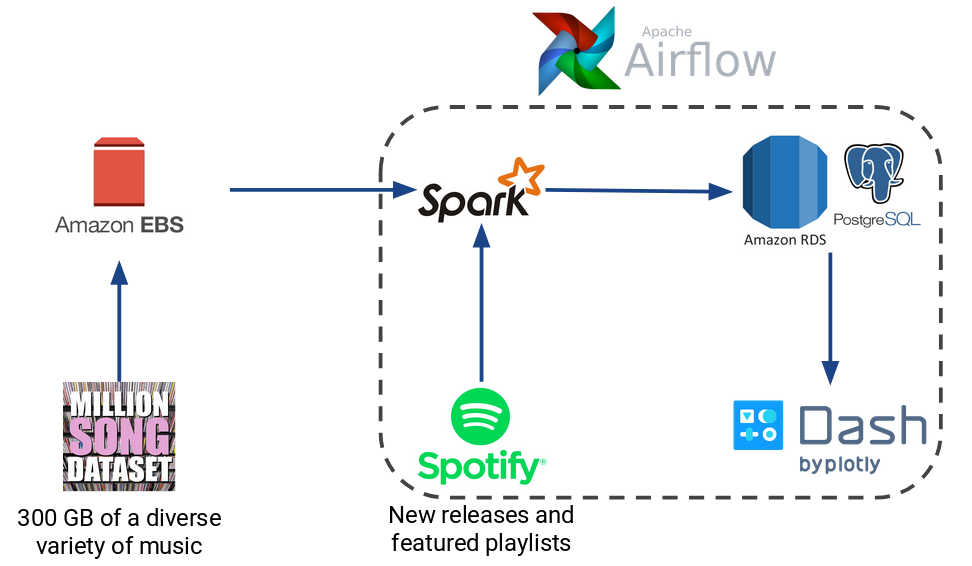

# Feature-Based Music Similarity Search
This repo contains the data processing pipeline for a content-based music similarity search. The pipeline indexes the Million Song Dataset by computing an embedding vector from the timbre and pitches features for each song in parallel on a Spark cluster. The song metadata and vectors are written to a PostgreSQL database and a locality-sensitive hashing similarity search index is constructed on the vectors through Faiss. The results of the similarity search are displayed through a frontend developed using Dash that shows the most similar songs to selected song.

## Components and Dependencies
- The Million Song Datset is loaded from the [public snapshot](https://aws.amazon.com/datasets/million-song-dataset/) onto **AWS EBS**.
- A **Spark** cluster is used to compute the embeddding vectors for the songs in parallel.
- A **PostgreSQL** database is used to store the song information and vectors.
- **Faiss** is used to construct a LSH index and compute the similiarity search.
- The **Spotify API** is used to retrieve new releases and featured playlists.
- **Airflow** is used to automatically retrieve and process new music from Spotify and update the database.
- **Dash** is used to build the frontend that display results of the similiarity search.

## References
1. [The Million Songs Dataset](http://millionsongdataset.com/)
2. [Spotipy, a Python interface for the Spotify API](https://github.com/plamere/spotipy)
3. [Faiss, a similiarity search package developed by Facebook](https://github.com/facebookresearch/faiss)
